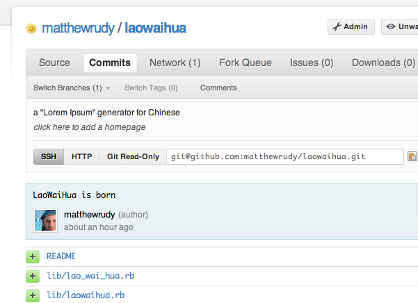

!SLIDE subsection

# "I don't have anything to talk about"

!SLIDE

# Yes you do

!SLIDE center

### Make something up

!SLIDE

# The idea
## "Lorem Ipsum" for Chinese

!SLIDE code incremental

# Example

* gem install laowaihua
* >> require 'laowaihua'
* >> LaoWaiHua()
* => 一位爷爷他姓顾，上街打醋又买布。买了布，打了醋，回头看见鹰抓兔。放下布，搁下醋，上前去追鹰和兔，飞了鹰，跑了兔。打翻醋，醋湿布
* >> LaoWaiHua.random(20)
* => 湿鹰搁买。下醋布。爷醋布。了头跑，前去打
* >> LaoWaiHua.random(50)
* => 了姓了。鹰买布去。飞看去，了跑。下醋醋姓。翻布跑，姓爷下了。飞了。回醋追顾。位前上街，顾醋他又。上姓

!SLIDE code

> 
<%= LaoWaiHua.random(20) %>

> 
<%= LaoWaiHua.random(50) %>

> 
<%= LaoWaiHua.random(75) %>

> 
<%= LaoWaiHua.random(50) %>

> 
<%= LaoWaiHua.random(15) %>

>
> <%= link_to "Projects", projects_path %>

!SLIDE center

### Score!